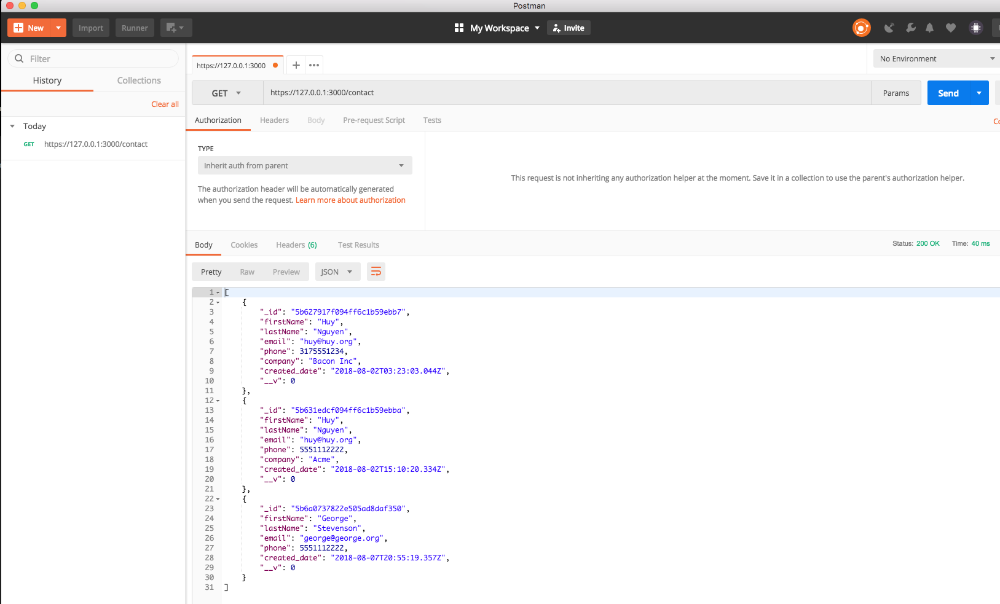
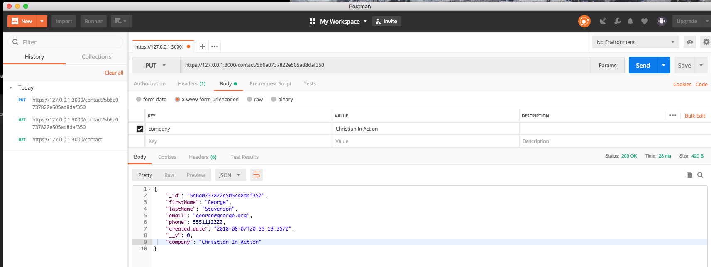
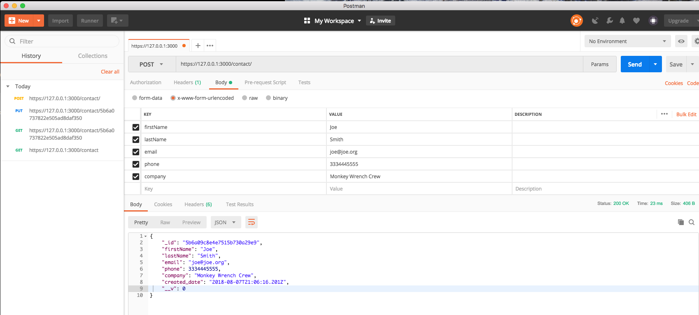
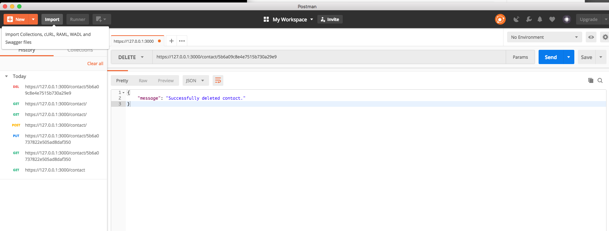

SpringBoot and .Net Web API are fast, but I think Node/Express is just as fast.  In this repo, I put together a "simulated" Customer Resource Management CRUD api endpoints.  I'm using mongodb as my database, I'm using POSTMAN to test the endpoints, and I'm using OpenSSL to test Node's https security protocol, there are plenty of tutorials out there on how to generate your own cert and key pem files, once you have that, put them in the config directory, only because that's where the code is calling them from.  
 
 Rund `npm run dev` to test in Postman.
 
 ###Routes
 getAll:
 
 
 getById:
 
 
 put:
 
 
 post:
 
 
 deleteById:
 
 
 
 More to come...
